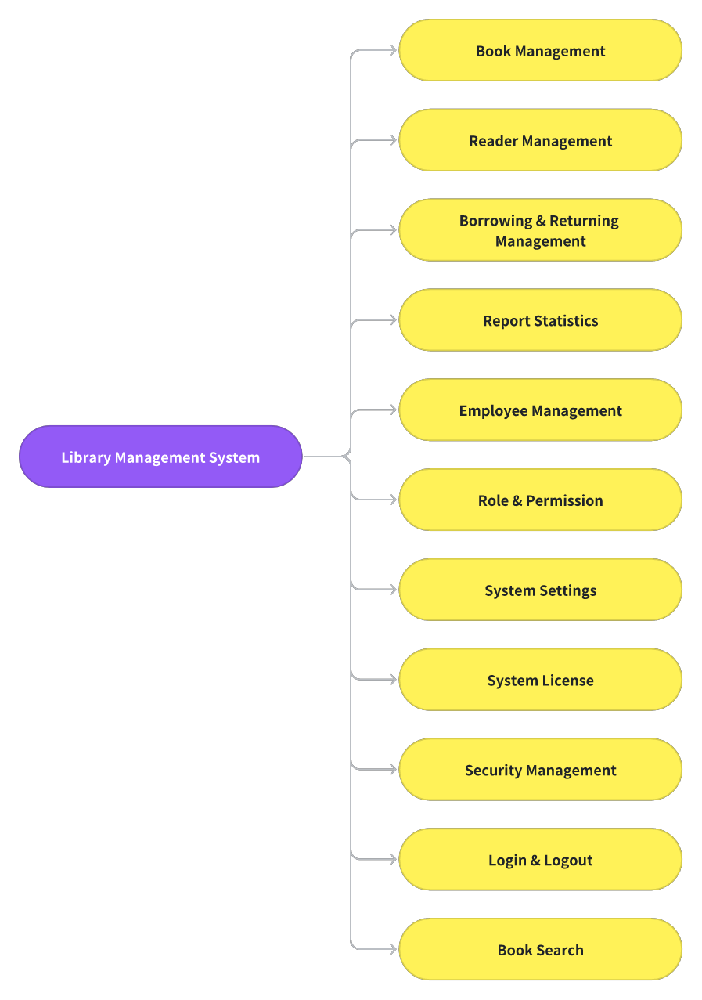

# lms
This is a library management system specifically designed for libraries and small and medium-sized schools. if you need it, you can communicate and discuss it

# Important Note
You can communicate via email to obtain the demonstration environment.
Consultation email:
lms.service24hour@gmail.com;lms.service24hour@outlook.com

## Overall Functionality

## Introduction
The system includes functions such as login, book management, reader management, borrowing management, statistical reports, employee management, role permissions, system settings, system authorization, and security management

### Login
Logging in with username, password, and one-time verification code can ensure the security of the system through secondary verification.

### Book Management
Book management includes three templates: book list, location management, and loss and damage management. Book list can realize the addition, editing, listing, and removal of books; Location management can maintain the location of books; Lost or damaged books can be recorded as damaged.

### Reader Management
Reader management includes two functions: maintaining reader information and class maintenance.

### Borrowing & Returning Management
Borrowing and returning management includes functions such as borrowing and returning queries, borrowing books, returning books, and renewing books. During the borrowing and returning process, electronic barcode scanners can be used to scan books for easy management.

### Report Statistics
The report statistics include daily borrowing frequency, popular book ranking, and reader borrowing ranking, which can provide a more comprehensive understanding of the library's data situation.

### Employee Management
Employee management provides maintenance of employee information, including enabling deactivation, resetting passwords, resetting secondary verification codes, etc.

### Role Management
Role management can provide precise permission maintenance, and role positions that are not accessible in the library can provide various permissions. So that different roles can be selected when adding employees.

### System Setting
The system settings support setting borrowing related parameters and default language. Currently, the system supports both English and Chinese languages.

### Security Management
Security management provides functions such as setting security parameters, auditing logs, data backup, and setting super administrator passwords.

### Book Search
Book search is used to provide readers with information on the status of books in the library, making it easier for them to search for books.

### Other
Additional information on other functions to be added later.

